# Wiedza to Potęga - 1 na 1

Quiz online dla dwóch graczy inspirowany teleturniejem "Wiedza to Potęga" (PS4 PlayLink).

## Screenshoty

### Ekran główny
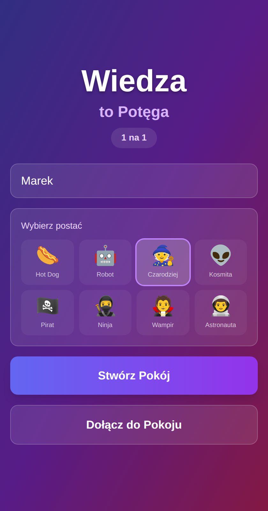
Wybierz awatara, wpisz imię i stwórz lub dołącz do pokoju.

### Poczekalnia
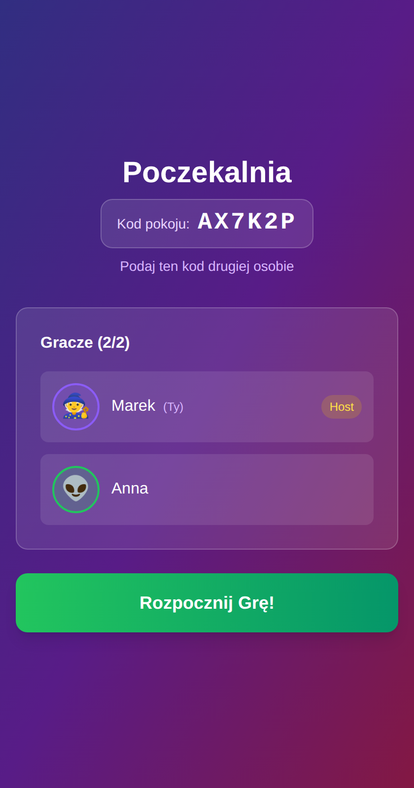
Poczekaj na drugiego gracza i rozpocznij grę.

### Głosowanie na kategorię
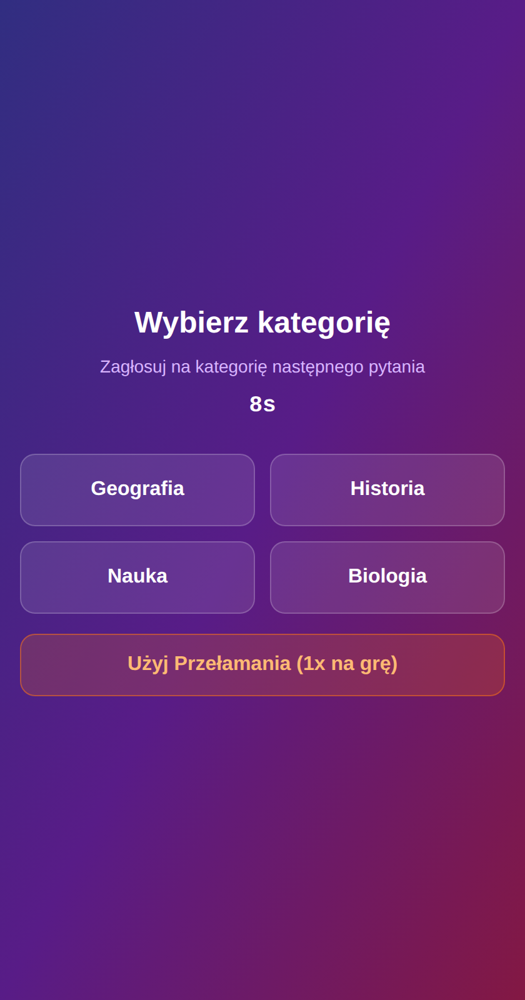
Wybierzcie kategorię pytań — lub użyj przełamania, by wymusić swoją kategorię!

### Wybór mocy
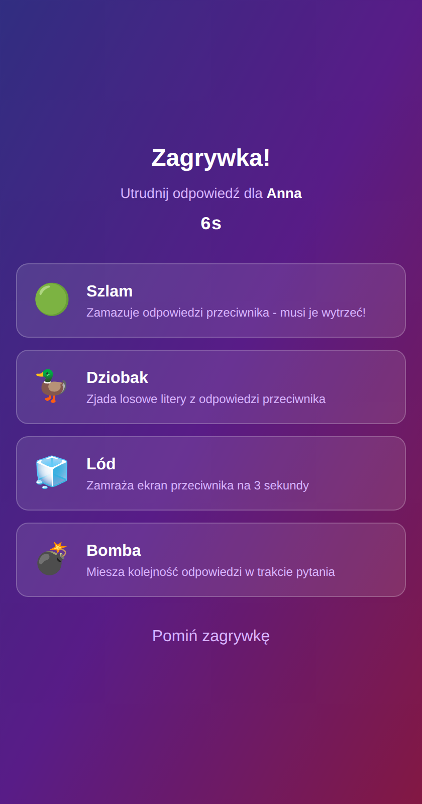
Przed każdą rundą wybierz moc, która utrudni grę przeciwnikowi.

### Pytanie
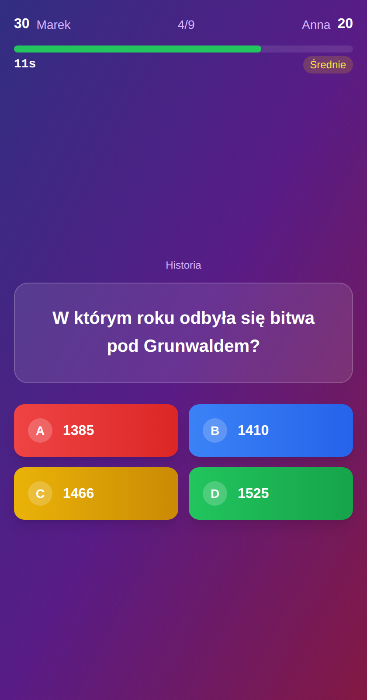
Odpowiadaj szybko — im szybciej, tym więcej punktów bonus!

### Przeszkadzajki (Power-upy)

**Szlam** — zielona maź zakrywa odpowiedzi, klikaj aby wytrzeć!
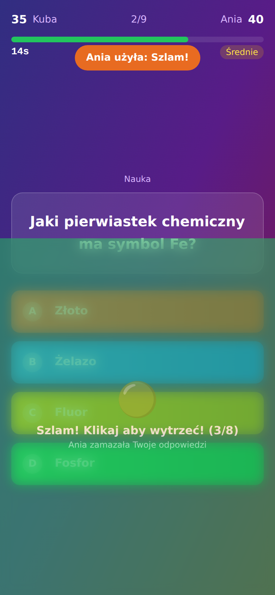

**Lód** — ekran zamraża się na 3 sekundy, nie możesz odpowiadać!
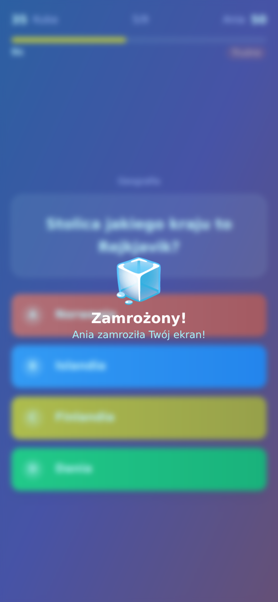

**Dziobak** — usuwa 40% liter z odpowiedzi, musisz zgadywać!
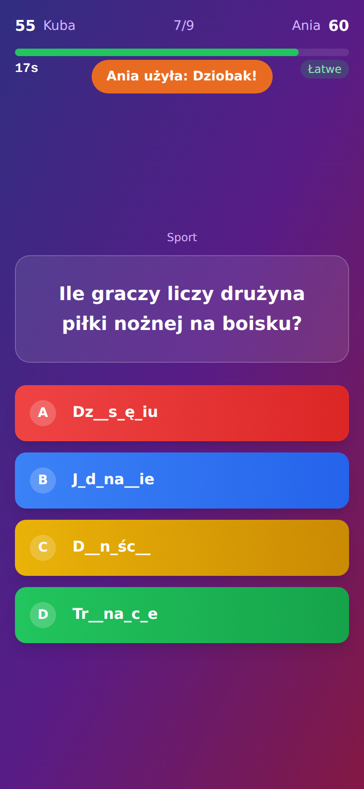

**Bomba** — po 3 sekundach odpowiedzi się losowo mieszają!
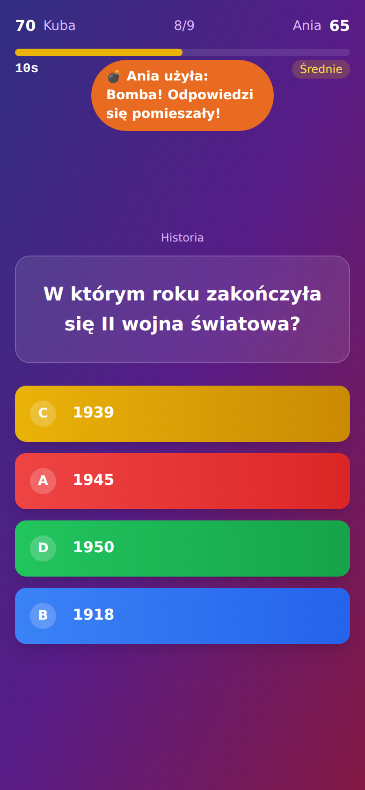

### Ujawnienie odpowiedzi
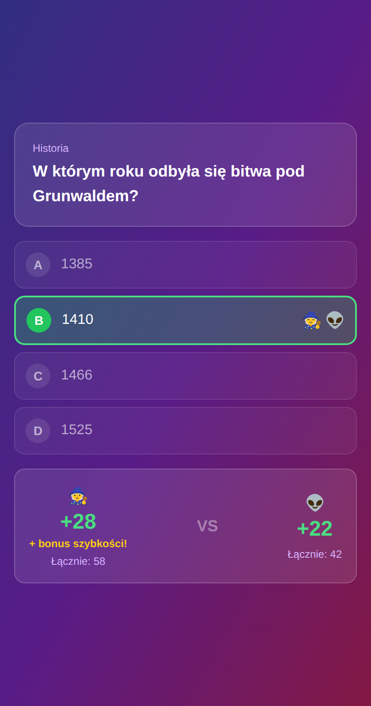
Po każdym pytaniu zobaczysz, kto odpowiedział poprawnie i ile punktów zdobył.

### Mini-gra
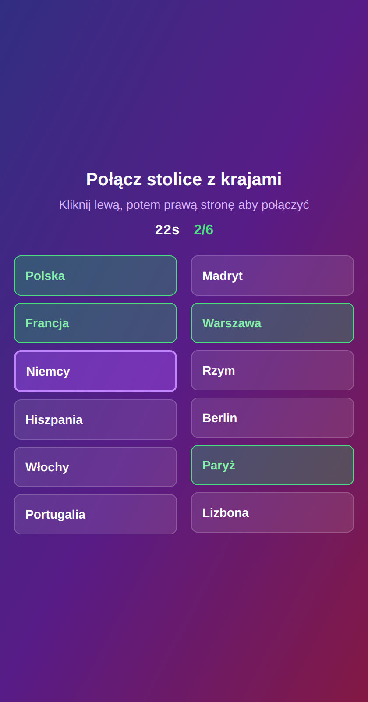
Między rundami zmierz się w mini-grze — łączenie par lub sortowanie elementów.

### Piramida Wiedzy
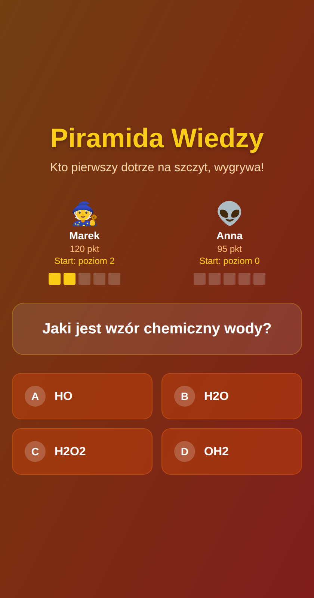
Wielki finał! Wspinaj się na szczyt piramidy, odpowiadając na pytania.

### Ekran końcowy
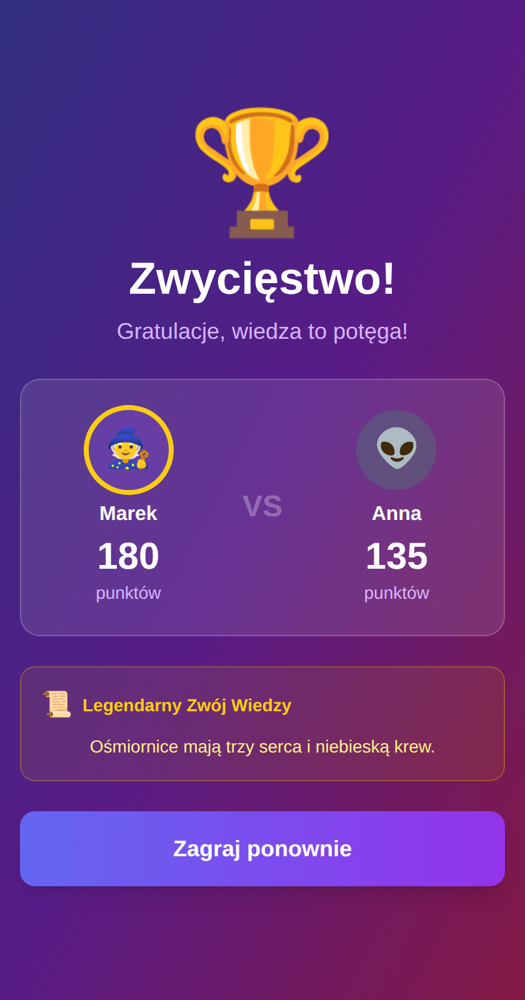
Zwycięzca otrzymuje Legendarny Zwój Wiedzy z ciekawostką!

## Funkcje

- Głosowanie na kategorię pytań (z opcją przełamania)
- 4 moce: Glut, Dziobak, Lód, Bomba
- Punkty za szybkość odpowiedzi (do +10 bonus)
- Mini-gry między rundami (łączenie par, sortowanie)
- Piramida Wiedzy — wielki finał
- 8 unikalnych awatarów
- Komentarze prowadzącego "Maks"
- Pytania z obrazkami
- Wbudowane pytania PL + Open Trivia DB API

## Technologie

- **Frontend**: React + TypeScript + Vite + Tailwind CSS
- **Backend**: Node.js + Express + Socket.io
- **Pytania**: Wbudowane pytania PL + Open Trivia DB API

## Uruchomienie lokalne

```bash
# Zainstaluj zależności
npm run install:all

# Uruchom (frontend + backend)
npm run dev
```

- Frontend: http://localhost:5173
- Backend: http://localhost:3001

## Deployment (Vercel + Railway)

### Backend — Railway

1. Zaloguj się na [railway.app](https://railway.app)
2. **New Project → Deploy from GitHub Repo** — wybierz to repo
3. W ustawieniach serwisu:
   - **Root Directory**: `server`
   - Railway automatycznie wykryje `railway.json` i zbuduje serwer
4. Dodaj zmienną środowiskową:
   - `CLIENT_URL` = URL twojej aplikacji na Vercel (np. `https://twoja-app.vercel.app`)
5. Skopiuj URL serwisu Railway (np. `https://twoja-app-production.up.railway.app`)

### Frontend — Vercel

1. Zaloguj się na [vercel.com](https://vercel.com)
2. **Add New Project → Import** — wybierz to repo
3. W ustawieniach:
   - **Root Directory**: `client`
   - **Framework Preset**: Vite
4. Dodaj zmienną środowiskową:
   - `VITE_SERVER_URL` = URL twojego serwisu Railway (np. `https://twoja-app-production.up.railway.app`)
5. Deploy!

### Kolejność
1. Najpierw deploy **Railway** (backend) — żeby mieć URL serwera
2. Potem deploy **Vercel** (frontend) — z ustawionym `VITE_SERVER_URL`
3. Wróć do Railway i ustaw `CLIENT_URL` na URL z Vercel

## Jak grać

1. Wejdź na stronę, wybierz awatara i podaj swoje imię
2. **Stwórz Pokój** — otrzymasz 6-znakowy kod
3. Podaj kod drugiej osobie — ta osoba wybiera **Dołącz do Pokoju**
4. Host rozpoczyna grę gdy obaj gracze są w pokoju
5. Głosujecie na kategorię → wybieracie moce → odpowiadacie na pytania
6. Co 3 pytania — mini-gra!
7. Na koniec — Piramida Wiedzy: wielki finał o zwycięstwo
8. Zwycięzca otrzymuje Legendarny Zwój Wiedzy!
